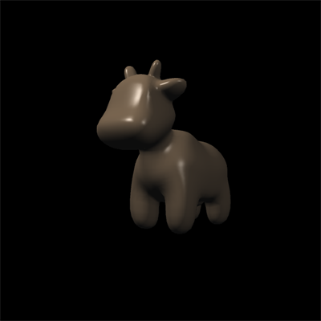
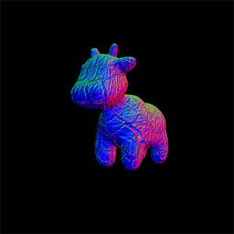
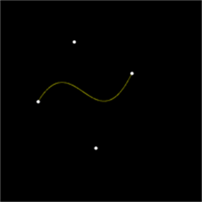
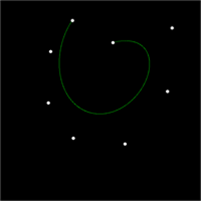
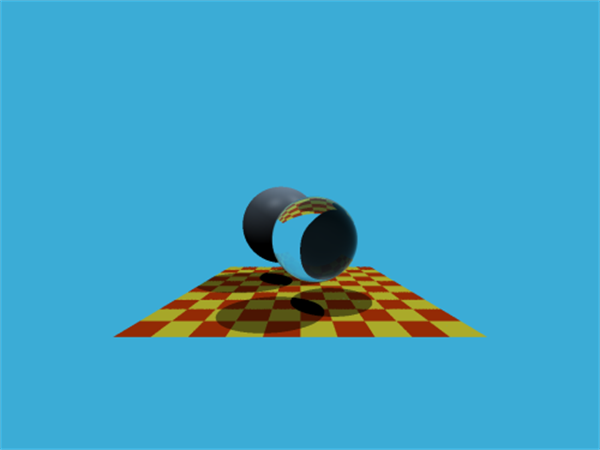

# Games101

这是学习GAMES101-现代计算机图形学入门课程的代码

课程网站： https://sites.cs.ucsb.edu/~lingqi/teaching/games101.html 

课程BBS：http://games-cn.org/forums/forum/graphics-intro/

主要内容：把课程代码重写到 windows 下

环境配置：

- Win10 + VS2019 + Eigen + opencv3.2
- 配置 IncludeDir、LibDir、Lib、DLL，opencv_world320d.dll 大小为60m+，无法上传
- 预处理：_CRT_SECURE_NO_WARNINGS

### A0: 环境配置

- 环境配置，熟悉 Eigen 库。


### A1：Matrix

- 设置 get_model_matrix() 。

- 设置 get_projection_matrix() ，n > 0, f > 0，并对 z 镜像，形成OpenGL系矩阵。

  ```c++
  // n > 0, f > 0
  //[ 2n/(r-l),    0,             0，          0，
  //    0，        2n/(t - b),    0,           0,
  //    0,         0,            (n+f)/(n-f),  2nf/(n-f),
  //    0,         0,             -1,         0]
  ```

- frame_buf 以左上角为原点，因为 opencv 从左上角读取，值域为（0, 255）。

- sample_buf 以以左上角为原点，值域为（0，1）。


### A2：Z-Buffer，MSAA

- 实现 MSAA，维护以下三个 buf：

  ```c++
  frame_buf.resize(w * h);
  sample_buf.resize(4 * w * h);
  depth_buf.resize(4 * w * h);
  ```

  对每个 pixel 中的每个 sample，各自维护 color 与 depth。

  光栅化时对每个 pixel，遍历 4 个 sample，若发现 sample 被修改了，则重新计算 frame_buf。


### A3: Fragment Shader

- TBN 矩阵中，增加一步使 t，n正交，但对 t 的表达式不懂。

  ```c++
  Eigen::Vector3f n = normal;
  float x = n.x();
  float y = n.y();
  float z = n.z();
  float sqxz = sqrt(x * x + z * z);
  Eigen::Vector3f t = Eigen::Vector3f(x * y / sqxz, sqxz, z * y / sqxz);
  t = (t - n.dot(t) * n).normalized(); 
  Eigen::Vector3f b = n.cross(t).normalized();
  Eigen::Matrix3f TBN;
  TBN << t, b, n;
  ```

  








### A4： Bezier Curve







### A5: Ray Trace




### A6: BVH and SVH

- BVH 可以 精确到 maxPrimsInNode = 1，即每个节点中保存一个 obj，但 SVH 不行，因为建树时，当 obj 个数为 2-3个时，float 精度已经不支持继续划分，会导致无限递归。
- BVH 测试，在 4000+ 顶点的 bunny 兔子模型下，当 maxPrimsInNode  在 5-10 之间时达到最快，其实也都差不多，最快为 16s。如果把 BVH 链表改为数组结构，可能会更快。
- SVH 测试，在 4000+ 顶点的 bunny 兔子模型下，当 maxPrimsInNode  在 5-10 之间时达到最快， num_buckets 取值为 8,16,25，随着 num_buckets 增大，建树速度会明显下降，从 2s 到 4s，但遍历速度都差不多，最快为 14s。
- SVH 参考资料：http://15462.courses.cs.cmu.edu/fall2015/lecture/acceleration


### A7: 未完成